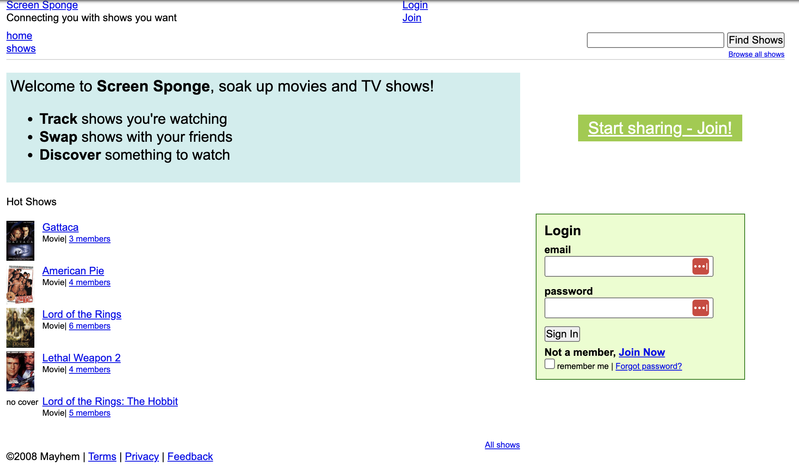

# Screen Sponge

Archive of the **Screen Sponge** project hosted at `ScreenSponge.com` developed by Jason Brownlee and Craig Baker circa 2008.

## About

**Screen Sponge**: Connecting you with shows you want.

Screen Sponge is a movie management web site where you manage all the movies and television shows you have, want, and have seen.

Screen Sponge provides an online community, connecting your broader circle of friends to trade shows they have that you want, write reviews, and discus the shows you love.

Signing up to Screen Sponge is free, and Amazon advertisements are shown on each show details page.

The core competition include the minimal movie management features on IMDb and the elaborate show management on Flickster.

The competitive advantage of Show Sponge is the focus on wanting and having shows and allowing users to make requests for shows on their social graph.

### Screenshot

# Code

The website was developed using ruby on rails.

A snapshot of the code for the website was saved before the site was shutdown at the end of 2008. A dump of the database was not archived.

* [screensponge-20081220.zip](src/screensponge-20081220.zip)
* [screensponge](src/screensponge/)

# Sources

* [ScreenSponge.com](https://web.archive.org/web/20080831041827/http://screensponge.com:80/) (archived)
* github.com/jbrownlee/screensponge
